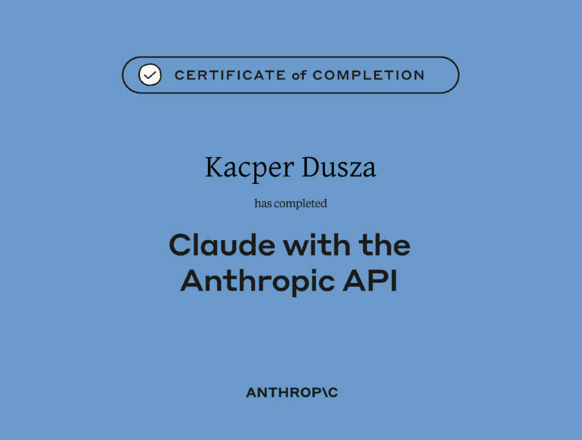

# Wtorek

- Zakończyłem kurs "Building with the Claude API", wraz z ćwiczeniami i zaliczonymi quizami.
- Jestem w trakcie zgłębiania wiedzy na temat bazy Redis oraz technologi LangChain oraz LangGraph

# Środa

#### Na laptopie i komputerze domowym skonfigurowałem: 

- Visual Studio Code do pracy z .NET, Nest.JS i Node.JS
- Claude Code

#### Oprocz tego:

- Przypomniałem sobie framework ASP.NET
- Rozpocząłem naukę Nest.JS i Node.JS
- Postawiłem na nowo Debiana 13 na laptopie w celu "odmulenia" systemu

# Czwartek

- Pobrałem Google Antigravity IDE, oraz założyłem konto na v0
- Uczestniczyłem w warsztatach prowadzonych przez kolegę Kamila, na temat generatywnego AI

- Wykonałem testowe zadanie z generacją prostej aplikacji webowej, której celem było konwertowanie walut z kursami w czasie rzeczywistym
   - Obyło się bez większych problemów, jednak model Gemini 3.5 Flash miał problem z implementacją historii zmian kursów
   - Rozwiązaniem okazało się zastosowanie modelu Claude Sonnet 4.6, który nie tylko zaimplementował poprawnie historie, ale też poprawił połączenie z API, które co jakiś czas bywało zrywane
   - Część z wygenerowanych testów jednostkowych nie przechodziło. Problemem okazał się być wcześniej wspomniany model Gemini. Po zmianie na model od Anthropic, testy zostały poprawione i pomyślnie zaliczone.
   
- Rozpocząłem prace nad systemem wykrywającym spam we wiadomościach

# Piątek

- Tworzę projekt ML polegający na wykrywaniu spamu oraz smshingu. Aplikacja postawiona jest we Flasku. Jak dotąd udało mi sie osiągnąć średnie 95% accuracy oraz precision modelu. Użyłem LogisticRegression w celu maksymalizacji prezycji i dokładności. Na dzień dzisiejszy udało się stworzyć działający model, wraz z podstawowym frontendem. W przyszłości dodam opcję analizy danych oraz baze to składowania danych. Końcowo projekt zostanie zdockeryzowany, oraz napisany zostanie bashowy skrypt który automatycznie wykona całą konfigurację za użytkownika.

- Zainstalowałem silnik Dockera, wraz z PostgreSQLem, pgAdminem oraz DBeaverem